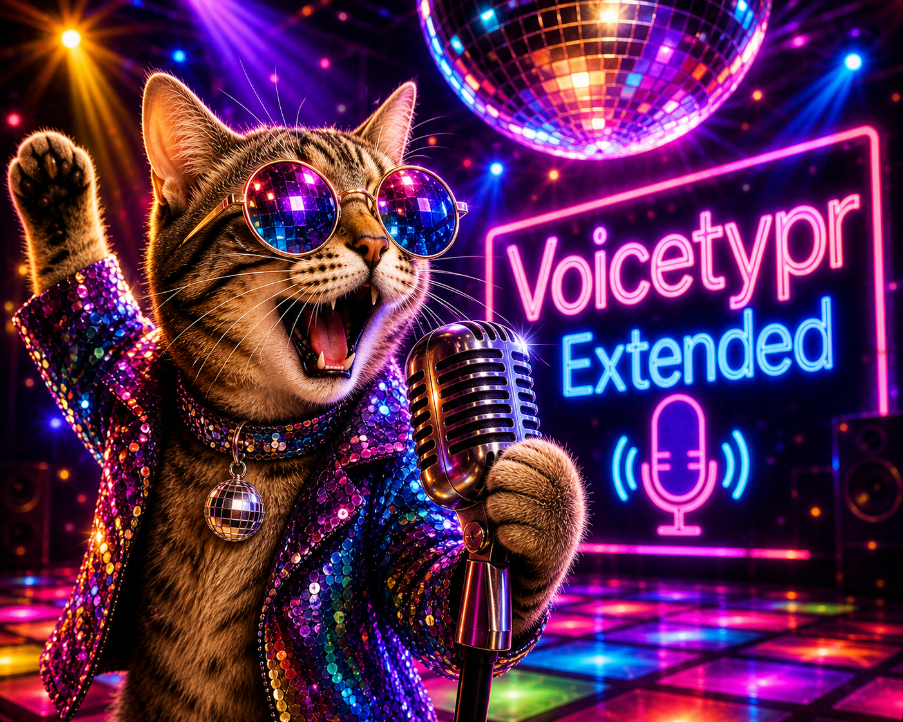

  
    
  

  # VoiceTypr — Personal Fork

  **A personal fork of [moinulmoin/voicetypr](https://github.com/moinulmoin/voicetypr) — an open source AI voice-to-text dictation tool for macOS and Windows.**

  
  
  

## 🍴 About this fork

This is **Tim Niemeier's personal fork** of VoiceTypr. All the heavy lifting — the recording engine, Whisper/Parakeet integration, the polished UI, the cross-platform plumbing — is the work of [**Moinul Moin**](https://github.com/moinulmoin) and the upstream contributors. Massive thanks to them for building and open-sourcing such a solid app under AGPL v3. If you want the official, supported, regularly-released version, **go to [moinulmoin/voicetypr](https://github.com/moinulmoin/voicetypr) and grab it there** — and consider supporting the project.

This fork exists for one reason: to scratch a few personal itches without bothering upstream. It is **not packaged for distribution, not signed, not notarized, and not a competing product**. If you stumbled in here, you almost certainly want the upstream repo instead.

### What's different in this fork

- ✏️ **Editable AI formatting prompts** — the four built-in prompt templates (base, prompts, email, commit) are exposed as editable textareas in the Formatting tab, with per-prompt reset to defaults.
- 🧹 **Sidebar & About cleanup** — license/upgrade UI removed, About section reworked to show fork status, upstream credits, and a fork-local changelog.
- 🔓 **License gate bypassed locally** — since this is a personal build, the trial/license check is short-circuited. The upstream app uses a paid license model; please respect that and pay for the official version if you use it.
- 📌 **Pinned to a specific upstream version** — currently tracking VoiceTypr **v1.12.3**. Periodically rebased on upstream `main`.

Everything else — features, architecture, install steps — is unchanged from upstream. The sections below are the upstream README, lightly trimmed.

## 🙏 Credits

VoiceTypr is created and maintained by [**Moinul Moin**](https://github.com/moinulmoin) at [moinulmoin/voicetypr](https://github.com/moinulmoin/voicetypr). This fork is a personal modification — all credit for the design, engineering, and ongoing maintenance belongs to Moin and the upstream contributors. If you find the app useful, please support the original project.

## 📄 License

VoiceTypr is licensed under the [GNU Affero General Public License v3.0](LICENSE.md). This fork inherits the same license; modifications in this fork are also released under AGPL v3.

